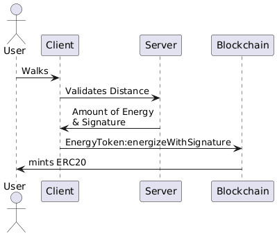
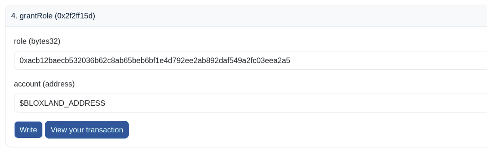
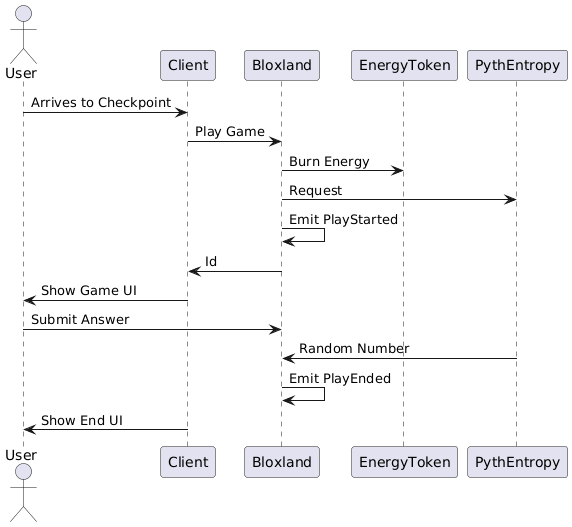
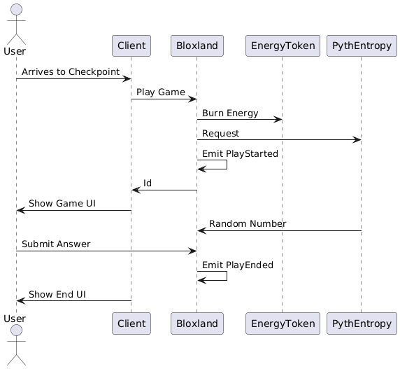

# Bloxland Contracts

## Configuration

Copy `.env.template` to `.env` and replace the private key and the backend signer.

## Energy Tokens

The first contract the user interacts with is `EnergyToken` that in the game
is minted after they complete a certain distance.

### Minting Sequence



<details>
```
@startuml
actor User
User -> Client : Walks
Client -> Server : Validates Distance
Server -> Client : Amount of Energy\n& Signature
Client -> Blockchain : EnergyToken:energizeWithSignature
Blockchain -> User : mints ERC20
@enduml
```
</details>

## Mini Games Contract

The `Bloxland` contract hold many mini-games to be played on-chain.

It uses Pyth Network to fetch external resources such an random numbers using
the entropy contract and the price of BTC using the oracle contract.

There are four games registered:

- Dice: guess a number from a randomly selected (using Pyth entropy) between
  one and six.
- Even or Odd: try to find out if a number between 1 and 100 that is random
  picked is divisible by two or not.
- Over Half: win when you found that a random number between 1 and 100 is
  greater than 50 or not.
- Greater than BTC Price: see how close you are of finding the BTC price (from
  the Pyth oracle).

The contract also supports off-chain deciding on winners of partner games using
EIP-712 signature standard.

### Deployment

1. First do the actual deployment:

   ```shell
   pnpm exec hardhat --network base-sepolia ignition deploy ignition/modules/Bloxland.ts
   ```

2. Then the verification of the contracts:

   ```shell
   pnpm exec hardhat --network base-sepolia verify etherscan $ENERGY_TOKEN_ADDRESS 0x06Cd761C51248207cebbB45c289D8689DE61F30e
   pnpm exec hardhat --network base-sepolia verify etherscan $BLOXLAND_ADDRESS 0xA2aa501b19aff244D90cc15a4Cf739D2725B5729 0x41c9e39574f40ad34c79f1c99b66a45efb830d4c 0x06Cd761C51248207cebbB45c289D8689DE61F30e 0xe441172596FF19c6B617Ee13C2eC45B1AD2da40C
   ```

3. Grant the role `BLOXLAND_ROLE` on `$BLOXLAND_ADDRESS`:

   

4. Send some ETH to `$BLOXLAND_ADDRESS`.

### Entropy Game Sequence

There are two possible scenarios.

#### That the answer arrives before the random number.



<details>
```
@startuml
actor User
User -> Client : Arrives to Checkpoint
Client -> Bloxland : Play Game
Bloxland -> EnergyToken : Burn Energy
Bloxland -> PythEntropy : Request
Bloxland -> Bloxland : Emit PlayStarted
Bloxland -> Client : Id
Client -> User : Show Game UI
User -> Bloxland : Submit Answer
PythEntropy -> Bloxland : Random Number
Bloxland -> Bloxland : Emit PlayEnded
Client -> User : Show End UI
@enduml
```
</details>

#### Or that the answer arrives after the random number.



<details>
```
@startuml
actor User
User -> Client : Arrives to Checkpoint
Client -> Bloxland : Play Game
Bloxland -> EnergyToken : Burn Energy
Bloxland -> PythEntropy : Request
Bloxland -> Bloxland : Emit PlayStarted
Bloxland -> Client : Id
Client -> User : Show Game UI
PythEntropy -> Bloxland : Random Number
User -> Bloxland : Submit Answer
Bloxland -> Bloxland : Emit PlayEnded
Client -> User : Show End UI
@enduml
```
</details>

### Oracle Game Sequence

<details>
```
@startuml
actor User
User -> Client : Arrives to Checkpoint
Client -> Bloxland : Play Game
Bloxland -> EnergyToken : Burn Energy
Bloxland -> Bloxland : Emit PlayStarted
Bloxland -> Client : Id
Client -> User : Show Game UI
User -> Bloxland : Submit Answer
Bloxland -> Bloxland : Emit PlayEnded
Client -> User : Show End UI
@enduml
```
</details>

## ENS Contract

A [subname registar](https://docs.ens.domains/wrapper/creating-subname-registrar)
has been developed as `BloxlandENS` contract.

### Deployment

```shell
pnpm exec hardhat --network sepolia ignition deploy ignition/modules/BloxlandSubnameRegistrar.ts
```

### Domain Registration

1. Go to https://sepolia.app.ens.domains and register `bloxland.eth`,
2. Wrap the domain in the "More" section from the manager app,
2. Deploy the contract `BloxlandENS`,
3. [Approve the deployed contract](https://docs.ens.domains/wrapper/creating-subname-registrar/#approve-your-contract)
   in the [name wrapper contract](https://sepolia.etherscan.io/address/0x0635513f179D50A207757E05759CbD106d7dFcE8#writeContract),
4. Lock the domain by removing `CANNOT_UNWRAP` in the "Permissions" section
   from the manager app.
