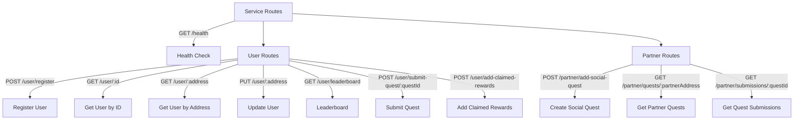

---

# 🚀 Quest API v2

Express.js + TypeScript backend powering **Users, Partners, Social Quests, Rewards, and Submissions**.

---

## 📦 Features

* User registration, profile update, leaderboard
* Quest creation, submission, winner assignment
* Reward claiming & tracking
* Partner APIs with access control
* Pagination for list endpoints
* Unified JSON response format

---

## ⚙️ Setup

```bash
git clone https://github.com/xhakti/bloxland
cd bloxland
npm install
cp .env.example .env
npm run dev
```

**Server:** [http://localhost:3000](http://localhost:3000)

---

## 🛠️ API Documentation

### ✅ Service Routes

#### Health Check

**GET** `/health`

**Response:**

```json
{ "status": "ok" }
```

---

### 👤 User Routes

Base path: `/user`

---

#### Register User

**POST** `/user/register`

```json
{
  "address": "0x123",
  "username": "alice",
  "email": "alice@example.com"
}
```

**Response:**

```json
{
  "data": {
    "user": { "id": "u1", "username": "alice" },
    "referrerRewardGranted": true
  },
  "message": "User created successfully",
  "error": null
}
```

---

#### Get User by ID

**GET** `/user/:id`

```json
{
  "data": { "id": "u1", "username": "alice" },
  "message": "User fetched successfully",
  "error": null
}
```

---

#### Get User by Address

**GET** `/user/:address`

```json
{
  "data": { "id": "u1", "username": "alice" },
  "message": "User retrieved successfully",
  "error": null
}
```

---

#### Update User

**PUT** `/user/:address`

```json
{ "username": "alice_updated", "email": "alice_updated@example.com" }
```

```json
{
  "data": { "id": "u1", "username": "alice_updated" },
  "message": "User updated successfully",
  "error": null
}
```

---

#### Leaderboard

**GET** `/user/leaderboard?page={page}&limit={limit}`

```json
{
  "data": {
    "users": [{ "id": "u1", "points": 500 }],
    "pagination": { "page": 1, "limit": 10, "totalCount": 50, "totalPages": 5 }
  },
  "message": "Leaderboard fetched successfully",
  "error": null
}
```

---

#### Submit Quest

**POST** `/user/submit-quest/:questId`

```json
{ "userAddress": "0x123", "submissionLink": "https://example.com/post" }
```

```json
{
  "data": { "questId": "q1", "submissionLink": "https://example.com/post" },
  "message": "Quest submission created successfully",
  "error": null
}
```

---

#### Add Claimed Rewards

**POST** `/user/add-claimed-rewards`

```json
{
  "userAddress": "0x123",
  "tokenAddress": "0xTOKEN",
  "tokenSymbol": "TKN",
  "tokenAmount": "100",
  "eventType": "SOCIAL_QUEST"
}
```

```json
{
  "data": { "id": "r1", "tokenSymbol": "TKN", "tokenAmount": "100" },
  "message": "Reward added successfully",
  "error": null
}
```

---

### 🤝 Partner Routes

Base path: `/partner`

---

#### Create Social Quest

**POST** `/partner/add-social-quest`

```json
{
  "partnerAddress": "0xPARTNER",
  "rewardToken": "0xTOKEN",
  "rewardAmount": "100",
  "rewardSymbol": "TKN",
  "questLocation": "twitter",
  "energyToBeBurned": "10",
  "questName": "Follow Project",
  "questDescription": "Follow us on Twitter",
  "partnerName": "Partner Inc"
}
```

```json
{
  "data": { "questId": "q1", "questName": "Follow Project" },
  "message": "Social quest created successfully",
  "error": null
}
```

---

#### Get Partner Quests

**GET** `/partner/quests/:partnerAddress?page={page}&limit={limit}`

```json
{
  "data": {
    "quests": [{ "questId": "q1", "questName": "Follow Project" }],
    "pagination": { "page": 1, "limit": 10, "totalPages": 2 }
  },
  "message": "Partner quests fetched successfully",
  "error": null
}
```

---

#### Get Quest Submissions

**GET** `/partner/submissions/:questId?page={page}&limit={limit}&partnerAddress=0xPARTNER`

```json
{
  "data": {
    "submissions": [
      { "submissionId": "s1", "user": "0x123", "link": "https://example.com/post" }
    ],
    "pagination": { "page": 1, "limit": 10, "totalPages": 1 }
  },
  "message": "Quest submissions fetched successfully",
  "error": null
}
```

**Error Response:**

```json
{
  "data": null,
  "message": "Unauthorized access",
  "error": "PARTNER_ADDRESS_MISMATCH"
}
```

---

## 📊 API Overview (Mermaid)



---